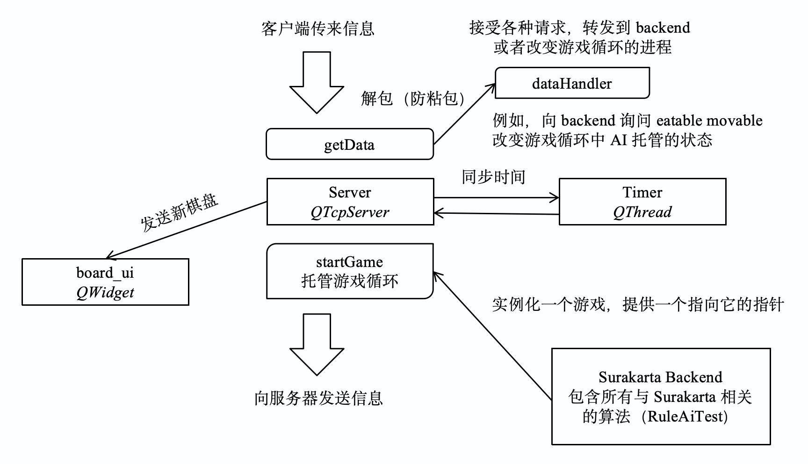
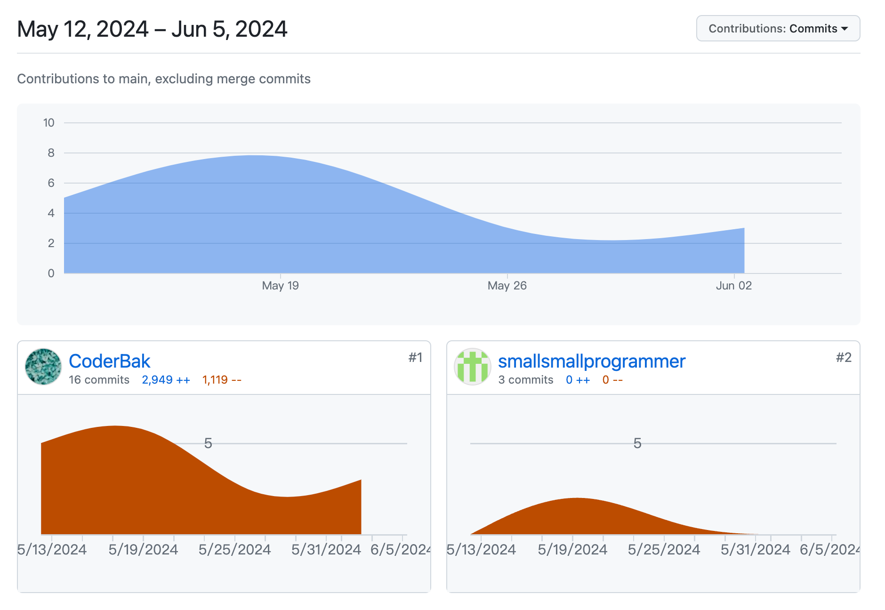
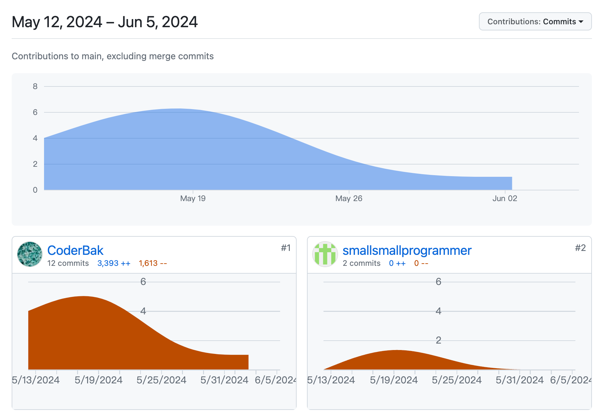
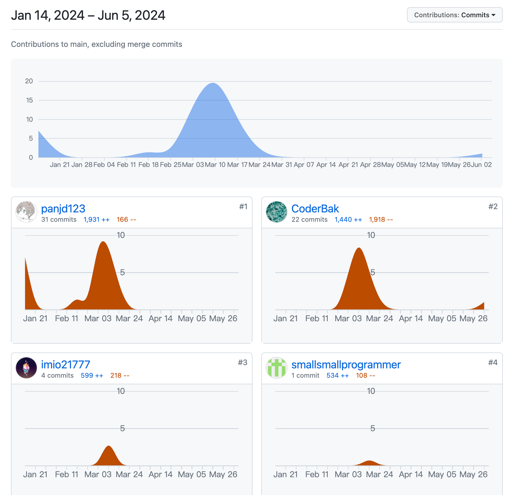

# Surakarta

## 项目介绍

该项目为中国人民大学程序设计 II 荣誉课程（C++）大作业.

我们使用 `C++ Qt` 设计并实现了 Surakarta（苏腊卡尔塔棋）游戏. 在设计上分为前端 [Surakarta-client](https://github.com/CoderBak/Surakarta-client) 与 后端 [Surakarta-server](https://github.com/CoderBak/Surakarta-server) ，支持跨平台联机对战，AI 托管等功能. 其中，跨平台联机对战功能已经在 Linux 作为服务器，Windows 和 Mac 作为客户端的环境下进行测试.

项目总网站：[https://github.com/panjd123/Surakarta](https://github.com/panjd123/Surakarta) ，感谢助教提供的框架与自动测试，欢迎 star ~

## 具体设计

下图中，一个方形框代表一个类，一个圆角矩形代表一个槽，一个对角圆角矩形代表一个常规函数.

### Server 框架



### Client 框架


### 详细解释

下面我们将以一局游戏为例，大致介绍我们的结构（更多细节例如按钮的连接暂时略去）：

- 设置按钮被点击，进入设置界面.

- 设置完成后，点击 `Apply` ，向 `MainWindow` 发送设置的具体内容.

---

- 回放按钮被点击，选择回放文件.

- `Replay` 界面中包含了 `ReplayBoard` 控件，前者向后者发送棋盘信息，后者绘制.

---

- 主菜单中开始按钮被点击，主菜单关闭，`client` 连接到 `server` ，进入游戏界面，游戏开始.

- `MainWindow` 中的 `socket` 从服务器端接受棋盘信息，将其转发给 `QtBoard` ，进行初次绘制.

- `QtBoard` 监测用户的鼠标位置，实现濒死提示. （`QtBoard` 是 `MainWindow` 窗口的一个控件）

- `QtBoard` 上的一个棋子被点击，`QtBoard` 向 `MainWindow` 发送 `movable` 与 `eatable` 请求. 其中 `movable` 是指可移动位置的列表，`eatable` 是指可吃子的列表和配套的吃子路径，这一部分将由服务器端的算法计算.

- `MainWindow` 将请求转发到服务器端，服务器端通过算法计算 `movable` 和 `eatable` 并返回给 `MainWindow` , `MainWindow` 将数据转发给 `QtBoard` .

- `QtBoard` 在收到数据后存储在自己的类中，并且显示高亮（可吃与可移动），在点击后依据收到的路径绘制动画.

- `QtBoard` 监测到用户的第二次点击操作，向 `MainWindow` 发送移动的棋子位置即 `MoveInfo` .

- `MainWindow` 将这个 `Move` 转发给服务器端.

- 服务器端为这个玩家进行一次 `Move` ，将新的棋盘回传给 `MainWindow` ，`MainWindow` 转发给 `QtBoard` 来更新棋盘.

- 在勾选 `AI托管` 后，`MainWindow` 向服务器端发送 `AI托管` 申请，服务器端则在下一个游戏循环使用 `agent` 作为该玩家的移动.

- 在取消勾选 `AI托管` 后，`MainWindow` 向服务器端发送 `取消AI托管` 申请，服务器端则在下一个游戏循环接受 `Move` 作为该玩家的移动.

- 在自己的轮次，点击 `再来一局` 后，`MainWindow` 向服务器发送 `再来一局` 申请，服务器端则重新开始游戏循环.

- 服务器端维护计时器，每秒向两个 `client` 同步时间，同时监测该步是否超时.

- 服务器端同时向自己的小棋盘发送棋盘更新，从而实现服务器端 `GUI` .

### 总结

从设计中可以看出，我们的 `client` 不要求对 Surakarta 规则有**任何**了解，仅起到一个前端的作用. 通过自定义协议的传输，我们得以实现这一点，从而 `client` 事实上只是一个绘图引擎. `server` 端依据其维护的游戏循环向双方不断沟通信息.

### AI 算法

这里我们通过贪心算法来实现 AI . 具体来说，我们通过某种策略计算了估价函数 $f$ ，对所有合法的移动与旋吃进行估价，使用优先队列取出最好的一种移动来作为计算结果. $f$ 的具体信息详见代码.

## 游戏功能完成情况

我们**准时**完成了**所有**基本开发任务与报告提交. 举例来说，我们在 `5.20` 准时提交了程序到网盘，提交了 `report3` ，同时验收通过了**全部阶段**. 具体来说：

1. `Stage 1` 中我们完成了**要求的**如下内容：

- 游戏规则的开发，已通过 Google Test

- 基于贪心（优先队列）的 AI 开发.

2. `Stage 2` 中我们完成了**要求的**如下内容：

- 客户端与服务端的信息交互

- 服务端的判断与游戏循环

- 客户端能移动棋子从而进行游戏

3. `Stage 3` 中我们完成了**要求的**如下内容：

- **随时**的 AI 接入

- 移动提示，以某种方式提示玩家所选棋子可以移动到哪

- 显示倒计时

- 显示结算信息（目前只显示在 server 端）

- 保存行棋记录，即日志系统

- 实现移动动画，包括旋吃、移动、路径高亮

- 实现濒死提示，禁止走会输的步

- 实现 8,10 路棋盘

- 实现客户端向服务端的连接

- 服务端的行棋合法性判断、胜负判断、超时判断

- 服务端行棋记录

- 实现发起对局

- 实现联机再来一局

- 提交了已经通过组内互联测试的命令行游戏

- 实现了日志系统

4. `Stage 4` 我们完成了**要求的**如下内容，共 5 个附加任务：

- **附加任务（新增）**：实现联机 AI 随时托管

- **附加任务 1**：实现移动棋子时的动画（包括绕外棋线）

- **附加任务 2**：实现重现对局 Replay Engine，支持播放暂停等功能

- **附加任务 6**：实现服务端 GUI 界面

- **附加任务 10**：热情地帮助其他同学解决大作业中遇到的问题（记录已发送给助教）

## 开发日志

以下是根据 `commit` 记录整理的开发日志，请查阅 `report1~3.md` 来获取之前的三次小报告.

- 孙浩翔 2023202305 ：`CoderBak` ，[https://github.com/CoderBak](https://github.com/CoderBak)

- 张昕跃 2023202300 ：`imio21777` ，[https://github.com/imio21777](https://github.com/imio21777)

- 王燚　 2023202262 ：`smallsmallprogrammer` ，[https://github.com/smallsmallprogrammer](https://github.com/smallsmallprogrammer)

---

- 2024-03-06 建立 `RuleAiTest-private` 仓库. 【孙浩翔】

- 2024-03-13 部分完成了 `JudgeEnd` 与 `JudgeMove`. 【孙浩翔】

- 2024-03-13 完成了第一版基于贪心算法的 AI . 【张昕跃】

- 2024-03-15 完成了 `JudgeEnd` 与 `JudgeMove` ，通过了 Google Test. 【孙浩翔】

- 2024-03-15 完成了第二版基于贪心算法的 AI . 【张昕跃】

- 2024-03-16 完成了第三版基于贪心算法的 AI . 【孙浩翔】

- 2024-03-20 建立 `Surakarta-Qt` 仓库，正式开始游戏开发. 【孙浩翔】

- 2024-03-24 重构并优化代码，**`Stage 1` 正式结束**. 【孙浩翔】

---

- 2024-03-25 彻底重构 `Surakarta-backend` ，完成棋盘绘制逻辑，并支持路径展示. 【孙浩翔】

- 2024-03-27 为棋盘添加了棋子. 【张昕跃】

- 2024-03-28 决定采用新的架构，`Surakarta-Qt` 项目终止，~~删库跑路~~. 【孙浩翔】

---

- 2024-04-05 建立 `Surakarta-server` 和 `Surakarta-client` 仓库，正式开始游戏开发. 【孙浩翔】

- 2024-04-05 合并 `Surakarta-backend` ，使用 `QTcpServer` 与 `QTcpSocket` 实现联机. 【孙浩翔】

- 2024-04-06 更新了协议，同时用信号槽机制实现了 `onUpdateBoard` . 【孙浩翔】

- 2024-04-10 加入了 `QtBoard` 类，从而支持了点击选择棋子. 【王燚】

- 2024-04-12 为游戏添加了按钮，即重来一局等. 【王燚】

- 2024-04-16 完善了棋盘绘制代码. 【张昕跃】

- 2024-04-17 支持了点击移动棋子与点击棋子特效. 【王燚】

- 2024-04-17 通过 `mouse tracking` 优化点击 UI . 【孙浩翔】

- 2024-04-20 `Camera ready` 版本，进行了跨平台联机测试，**通过了 `Stage 2` 验收**. 【孙浩翔】

---

- 2024-04-22 添加再来一局功能，添加旋吃与移动指示特效. 【孙浩翔】

- 2024-04-24 为游戏添加了计时器与超时判断. 【张昕跃】

- 2024-04-27 完善了计时器与超时判断. 【张昕跃】

- 2024-05-11 尝试合并助教提供的网络库，但是最终没有采用. 【张昕跃】

- 2024-05-13 完成了第一版棋子移动动画. 【王燚】

- 2024-05-13 向服务器端添加了 UI 界面，修复内存泄露. 【孙浩翔】

- 2024-05-15 完成了动画，包括旋吃、移动、路径高亮. 【孙浩翔】

- 2024-05-16 为游戏添加了菜单和设置，添加若干按钮. 【王燚】

- 2024-05-17 添加 AI 托管功能，添加濒死提示，添加 log 保存目录选择. 【孙浩翔】

- 2024-05-18 添加了开始游戏按钮. 【张昕跃】

- 2024-05-18 建立 `Surakarta-server-demo` 和 `Surakarta-client-demo` 仓库. 【孙浩翔】
- 2024-05-19 完成了 `Surakarta-server-demo` 和 `Surakarta-client-demo`. 【孙浩翔】

- 2024-05-20 **按时完成了 `Stage 3` 验收**. 【孙浩翔】

- 2024-05-22 完成了日志系统，完成了回放引擎. 【孙浩翔】

具体贡献请见 `GitHub Insights` .

## 设计亮点

I. `client` 与 `server` 的分离设计，使得 `server` 可以独立部署在服务器上.

II. 合理的设计

- 我们将所有常量打包在 `common.h` 里面，例如服务器端口，`BOARD_SIZE`，棋子半径等等，实现了参数与代码完全分离，避免代码中大量 `magic number` 的出现.

- 使用信号槽来在类、控件之间交换数据.

- 充分的代码注释.

- 明确的文件结构，没有将全部源文件放到一个文件夹下.

III. `const correctness` 的充分保障，在所有应该使用 `const` 声明的位置均使用了 `const` 声明.

IV. C++ 新特性的充分使用

在编程过程中使用各种语法糖和新特性，例如 `auto binding` (since C++17) ，`lambda function` (since C++11) ，`auto` (since C++11) ，`for-each loop` (since C++11) ，`if with initializer` (since C++17) 来大幅增强代码可读性和简洁程度.

V. 代码风格统一化，`CoderBak` 规定了必要的代码规范，例如驼峰命名法，使得代码可读性更强.

VI. 更精简的架构，在使用 `clang-tidy` 和限制一行代码长度的情况下， `Surakarta-server` ~~仅~~ `1466` 行代码，`Surakarta-client` ~~仅~~ `1463` 行代码，~~组员们五一还出去玩耍了，没有卷（大雾）~~

VII. 内存更加安全，例如，当一个 `client` 失去连接时，`server` 再次发送信息可能会导致未定义行为，我们采用如下的方式来处理 `socket` 的断开

```cpp
connect(client1, &QTcpSocket::disconnected, this, &Server::socketDisconnected1);
connect(client2, &QTcpSocket::disconnected, this, &Server::socketDisconnected2);

void Server::socketDisconnected1() {
    if (client1) {
        qDebug() << "Game stopped because client 1 stopped";
    }
    socketDisconnected();
}

void Server::socketDisconnected2() {
    if (client2) {
        qDebug() << "Game stopped because client 2 stopped";
    }
    socketDisconnected();
}

void Server::socketDisconnected() {
    if (client1) {
        qDebug() << "Client 1 stopped.";
        client1->deleteLater();
        client1 = nullptr;
    }
    if (client2) {
        qDebug() << "Client 2 stopped.";
        client2->deleteLater();
        client2 = nullptr;
    }
}
```

这样只要有一个 `client` 断开，游戏自动结束，`server` 恢复到监听状态.

VIII. 充分利用 `move semantics` 移动语义，通过尽可能使用 `emplace_back` 等移动语义来优化代码.

IX. 运算符重载，通过重载运算符（例如 Move 的 == 运算符）来使得代码清晰易懂.

X. STL 的充分使用，通过使用 STL 自带的优先队列，简化了代码.

XI. 显式类型转换，在各种运算中，不可避免地要出现 `unsigned int` 加 1 减 1 之类的情况. 我们通过 `static_cast` 进行显式类型转换，防止 `unsigned int` 出现溢出，更加安全.

## 程序发布

我们将打包好的程序发布在 [Surakarta-server-v1.0](https://github.com/CoderBak/Surakarta-server/releases/tag/v1.0) 和 [Surakarta-client-v1.0](https://github.com/CoderBak/Surakarta-client/releases/tag/v1.0) .

目前已知的问题：关闭 `server` 窗口后进程并没有退出，需要手动结束才能重新启动 `server` .

已经在 Windows 平台测试过功能，具体如下：


## 附录：提交的压缩包中的剩余代码说明

（该部分是项目报告的一部分，请在 `README` 中忽视）

- `Surakarta-Qt` ：开发的第一代 Surakarta 棋，主要演示了绘制逻辑


- `Surakarta-server-demo` ：开发的无 GUI demo 版本，旨在支持与其他组的联机对战与命令行操作

项目网站：[https://github.com/CoderBak/Surakarta-server-demo](https://github.com/CoderBak/Surakarta-server-demo)



- `Surakarta-client-demo` ：开发的无 GUI demo 版本，旨在支持与其他组的联机对战与命令行操作

项目网站：[https://github.com/CoderBak/Surakarta-client-demo](https://github.com/CoderBak/Surakarta-client-demo)



- `Surakarta-RuleAiTest-private` ：Surakarta 第一阶段测试，已通过 Google Test

项目网站：[https://github.com/CoderBak/Surakarta-RuleAiTest-private](https://github.com/CoderBak/Surakarta-RuleAiTest-private)


